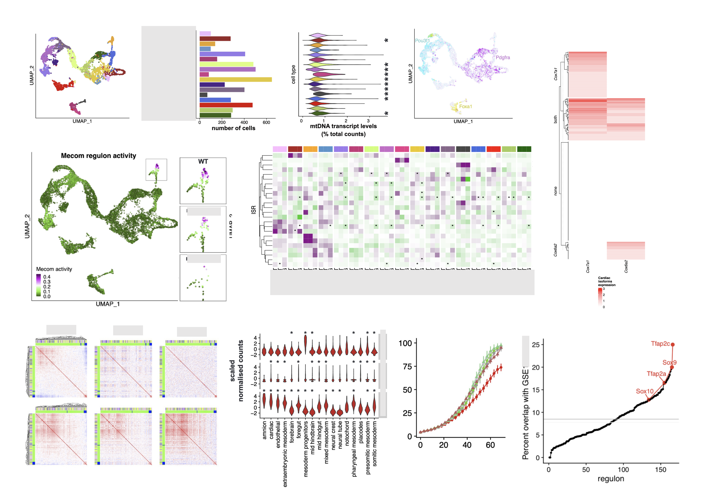

### Hi there 👋

# 💫 About Me:
I am a computational biologist with 6 years of experience in collaborative research and NGS data analysis. I am providing bioinformatics support to Patrick Chinnery’s group at MRC MBU, University of Cambridge. With expertise and experience in scientific research and bioinformatics, I am uniquely positioned to integrate and consult on both areas of wet lab and dry lab research. My passion is seeing scientific advances benefiting the world.

I am excited about collaborative science, data integration, visualisation. My recent work focuses on exploring and in depth analysis of single cell RNA-seq and multiome (scRNA-seq + ATAC-seq) datasets.

 

## 🌐 Socials:
 

# 💻 Tech Stack:
         

# 📊 GitHub Stats:
 
 

---

