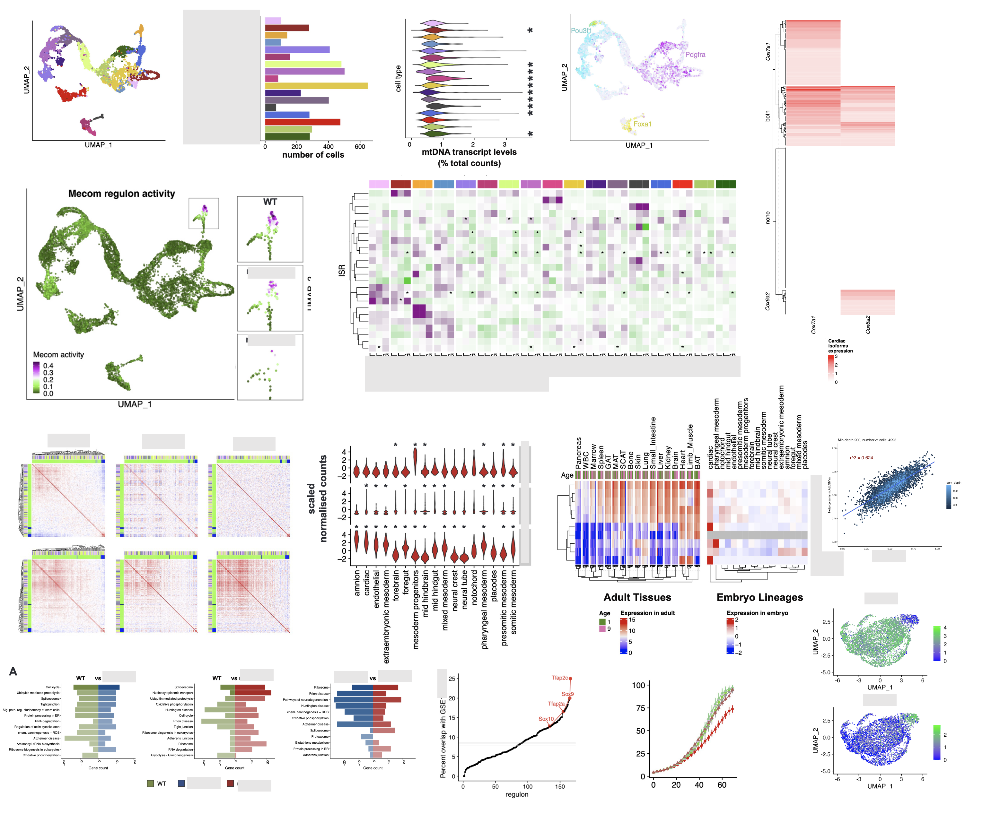

### Hi there!

# About Me:

I am a bioinformatician with 7.5 years of experience in collaborative research and NGS data analysis. I am uniquely positioned to integrate and consult on both areas of wet lab and dry lab research. My passion is seeing scientific advances benefiting the world. If you want to know, more check this out: https://nmalwinka.github.io/

I am excited about collaborative science, data integration, visualisation. My past work focused on exploring and in depth analysis of single cell RNA-seq, CROP-seq and MultiOme (scRNA-seq + ATAC-seq) datasets, with current shift towards pooled CRISPR screens (whole genome and custom screens, in-vivo, single cell Perturb-seq, epigenetic, base editing screens, etc.) and gene isoforms analysis.

(I need to update the figure below!)

I have experience in working on HPC and AWS, running jobs on schedulers, working with pipelines (mainly Nextflow).

 

## Socials:
 

---

