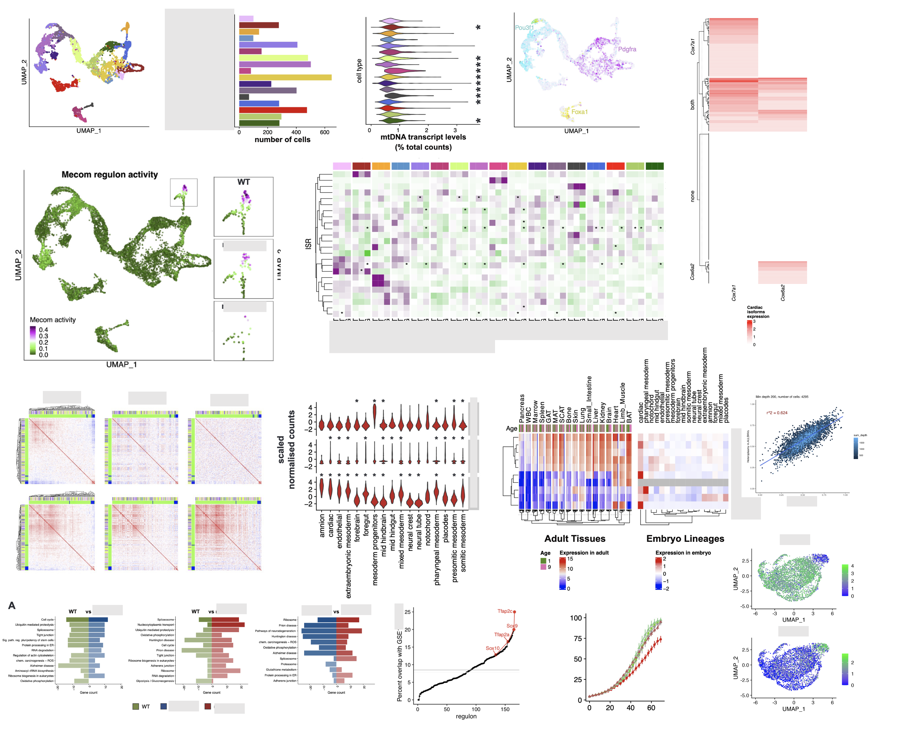

### Hi there!

# About Me

I am a bioinformatician with 9 years of experience in collaborative research and NGS data analysis, working across the wet lab / dry lab boundary. I am uniquely positioned to integrate and consult on both areas of research, and my passion is seeing scientific advances benefiting the world. If you want to know more, check this out: https://nmalwinka.github.io/

I am excited about collaborative science, data integration and visualisation. My work spans single-cell and spatial transcriptomics, pooled CRISPR screens, and building the pipelines and dashboards that let teams run these at scale.

## What I work on

**Spatial transcriptomics (Xenium)**
- QC frameworks for imaging-based spatial data: image quality (SNR, focus / blur detection), molecule QC, and tissue-extent segmentation masks
- Metric drift analysis and cross-cohort calibration to gate high-quality samples into downstream and machine-learning analysis
- Spatial analysis for publication: cell typing, compositional and spatial statistics, and cross-species validation

**CRISPR screens — design, analysis & tooling**
- Pooled CRISPR screens: whole-genome and custom, in-vivo, single-cell Perturb-seq, epigenetic and base-editing screens
- Guide design and selection across CRISPRa / CRISPRi / knockout modalities
- Screen design for FACS, colony-forming-efficiency (CFE) and viability screens
- Library / plasmid QC and screen analysis, and troubleshooting unsuccessful screens

**Single-cell & multiomics**
- In-depth analysis of single-cell RNA-seq, CROP-seq and MultiOme (scRNA-seq + ATAC-seq)
- Gene isoform analysis

**Pipelines, tooling & infrastructure**
- Building and optimising bioinformatics tools and pipelines, including the Xenium spatial processing pipeline, with a focus on speed, memory and compute cost at scale (e.g. whole-genome guide design)
- Nextflow / Seqera pipeline development, including tuning Seqera compute environments and executor settings for efficient, scalable runs
- Containerisation with Docker and container-image management via AWS ECR
- HPC and AWS, running jobs on schedulers, reproducible workflows, and some infrastructure-as-code (Terraform)
- Interactive dashboards for visualisation, filtering and reporting

## Tech & tools

## Selected past work

The figure below is not my most up-to-date work, but highlights some of my past single-cell analysis associated with this publication: https://doi.org/10.1016/j.cell.2023.01.034

 

## Socials

---

